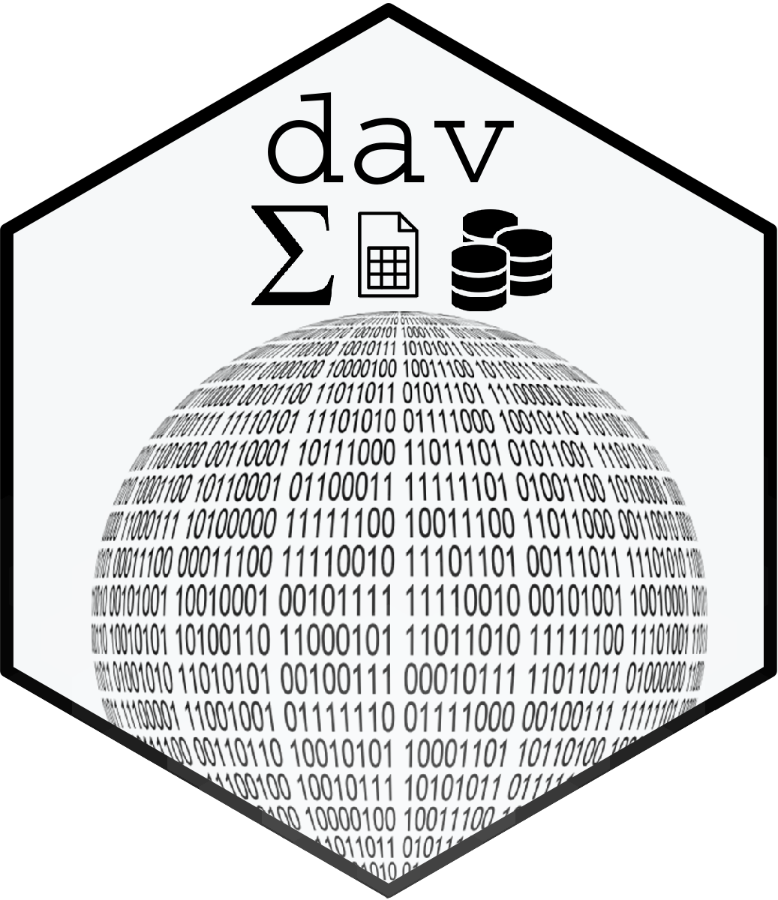

<!-- README.md is generated from README.Rmd. Please edit that file -->

```{r, include = FALSE}
knitr::opts_chunk$set(
  collapse = TRUE,
  comment = "#>",
  fig.path = "man/figures/README-",
  out.width = "100%"
)
desc <- read.dcf("DESCRIPTION")
desc <- setNames(as.list(desc), colnames(desc))
```

# `r desc$Package` 

> `r desc$Desc`

<!-- badges: start -->
[](https://lifecycle.r-lib.org/articles/stages.html#experimental)  
<!-- badges: end -->

<div id='tldr'>
 
* [Get started][]
* [Documentation][]
* [Frequently asked questions][FAQ]

</div>

## :package: Installation

The package is currently **under construction :construction:**.

``` r
devtools::install_github("D-Se/sandbox")
```
